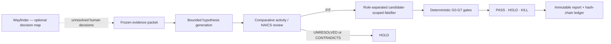

<div align="center">

# Venture Lab

### Evidence before enthusiasm.

An evidence-governed AI research lab for deciding which business thesis deserves
the **next validation dollar**—and what observation should make you stop.

[](https://www.python.org/)
[](https://github.com/iangogentic/venture-lab/actions/workflows/ci.yml)
[](LICENSE)
[](#current-maturity)
[](#decision-language)

</div>

---

Venture Lab turns frozen real-world evidence into bounded business hypotheses,
attacks those hypotheses with a role-separated, candidate-blind falsifier, and
applies deterministic policy gates before anything can advance.

It is deliberately **not** an AI oracle that invents a “best business” score.
Missing evidence stays missing. A plausible narrative is not demand. A mandate is
not willingness to pay. A full market is not automatically an attractive market.

> **Current honest status:** the engine is working and fails safely, but it has
> not validated a winning business. The latest research candidates remained
> `HOLD` because direct capacity, willingness-to-pay, competition, and stressed
> unit-economics evidence was still incomplete.

## The problem it solves

Most idea generators optimize for persuasive output. Venture Lab optimizes for
an inspectable decision trail:

| Typical idea generator | Venture Lab |
| --- | --- |
| Ranks attractive stories | Exposes unresolved facts |
| Blends unlike evidence into one score | Keeps metrics in natural units |
| Treats search results as market proof | Requires claim-to-source references |
| Lets the model make the decision | Uses models as untrusted analysts |
| Quietly fills gaps with assumptions | Converts unknowns into `HOLD` |
| Produces prose | Produces a verifiable artifact graph and hash ledger |

## How it works



One scan:

1. Loads one normalized `EvidencePacket` with an explicit information cutoff.
2. Gives a tool-free model a bounded set of measurements and lets it propose a
   limited number of hypotheses.
3. Enforces geography, market-topic, scenario, evidence-reference, provider
   activity, and customer-industry boundaries.
4. Compares every sold activity against every eligible provider-side NAICS scope.
5. Gives a role-separated falsifier only the evidence relevant to that candidate.
6. Applies fixed G0–G7 policy. No model may override the gates.
7. Writes canonical scoped packets, validated review artifacts, gates, and the
   report once.
8. Hashes the run artifacts into a chained ledger and verifies them end to end.

## Safety and research invariants

- **Models analyze; code controls.** Analyst models have no tools and cannot
  execute commercial actions.
- **Unknown is a first-class value.** It is never silently converted to zero,
  false, or a favorable estimate.
- **No weighted master score.** Once natural-unit metrics are complete, a
  scenario-specific Pareto comparison may expose nondominated candidates.
- **Classification is comparative.** A candidate cannot be approved by matching
  one convenient industry code while ignoring plausible alternatives.
- **Artifacts are write-once.** Reusing a run ID with different inputs fails.
- **Validated reviews are auditable.** Completed v6 runs preserve canonical
  structured comparative-classification and falsification artifacts. Failed
  structured reviews bind a quarantine record; raw provider HTTP bytes are not
  retained.
- **External actions require a human.** The workflow does not contact customers,
  investors, or vendors; buy ads or data; accept deposits; or perform regulated
  work.
- **A kill switch is always available.** Create `STOP` at the venture output root
  or inside an active run directory to stop between operations.

## Quickstart

You need Python 3.13, [`uv`](https://docs.astral.sh/uv/), and—only for live model
runs—a configured model-provider key. The example below uses OpenAI directly;
the inherited OpenRouter route remains available too.

```bash
git clone https://github.com/iangogentic/venture-lab.git
cd venture-lab
uv sync
uv run op doctor
```

Create the reviewed pilot evidence packet:

```bash
uv run op venture seed /tmp/venture-evidence.json
```

Run a bounded model-backed scan:

```bash
export OPENAI_API_KEY='set this outside the repository'
export LLM_TRANSPORT=openai
export LLM_USE_CATALOGUE=false

uv run op venture scan /tmp/venture-evidence.json \
  --run-id my-first-venture-scan \
  --mode llm \
  --model openai/gpt-5.4-mini \
  --max-hypotheses 6 \
  --max-cost-usd 20
```

Read and independently verify the result:

```bash
uv run op venture show my-first-venture-scan
uv run op venture verify my-first-venture-scan
```

The tests and offline fixtures require no API key:

```bash
uv run pytest -q
uv run ruff check app tests
uv run ruff format --check app tests
uv run mypy --strict app tests
```

Configuration examples live in [`.env.example`](.env.example). Never commit a
real `.env` file or provider credential.

## Decision language

| Decision | Meaning |
| --- | --- |
| `HOLD` | A prerequisite is false or unknown. This is the expected outcome for thin evidence. |
| `PASS` | Every predicate at the evaluated scope passed. It is **not** proof that the business is validated. |
| `KILL` | A verified explicit disqualifier or preregistered field-test failure was observed. A model allegation alone cannot execute a kill. |

The policy is intentionally demanding:

| Gate | Question |
| --- | --- |
| G0 | Is the customer, payer, geography, operator constraint, scenario, and horizon defined? |
| G1 | Do critical claims have independent sources and a primary record? |
| G2 | Were quantitative claims reproduced and contradictions bounded? |
| G3 | Did role-separated falsification clear substitution, latent competition, regulatory supply, contestable spend, willingness to pay, and stressed economics? |
| G4 | Do natural-unit economics survive staffing, acquisition, utilization, working-capital, and time-to-cash stress? |
| G5 | Is the riskiest field test preregistered with sample, metric, threshold, budget, stop rule, and kill rule? |
| G6 | Did the preregistered primary test pass, with post-hoc work labeled exploratory? |
| G7 | Are scenario metrics complete enough for a Pareto comparison? |

## Evidence model

The bundled seed packet is a frozen, reviewed snapshot assembled from official
sources, including U.S. Census datasets and NAICS definitions, CMS provider data,
IRS aggregates, USAspending, and California regulatory/licensing records.

Every measurement carries:

- a stable measurement ID;
- source family and source URL;
- geography and observed period;
- unit and value;
- caveats and quality flags; and
- explicit proxy/counterevidence labels where applicable.

That packet proves exactly which normalized rows the analysts saw. It does not
yet prove complete raw-download and transform lineage for every row; that remains
a production-hardening milestone.

## Current maturity

Venture Lab is a **research prototype**, not investment advice or an autonomous
company builder.

What is verified today:

- the full repository test suite passes;
- strict Ruff and MyPy gates pass;
- completed runs can be replay-verified against immutable artifacts and the
  chained ledger;
- budget ceilings and the kill switch fail before model calls; and
- no candidate can advance merely because its prose sounds compelling.

Known limitation: activity-level classification is not reliable enough for
autonomous advancement. Red-team review found a false `FIT` when an offer's sold
activities did not fit any supplied NAICS scope. Until structured per-activity
mapping and independent adjudication land, treat model `FIT` as provisional and
keep human review in the loop.

## Repository map

```text
app/venture/
├── analysts.py          bounded generation, comparison, and falsification
├── core/                typed models, policy gates, Pareto logic, snapshots, ledger
├── pilot.py             immutable run orchestrator and verifier
├── pilot_evidence.py    reviewed official-source seed packet
├── provenance.py        canonical artifacts and implementation manifests
├── reporting.py         human-readable evidence and gate reports
└── sources/             official-source adapters and parsers

tests/venture/           venture-specific unit, policy, provenance, and adapter tests
VENTURE_LAB.md           detailed operating and interpretation notes
UPSTREAM.md              source lineage and clean-history rationale
```

## Wayfinder, Codex, and GPU Cats

Venture Lab is the evidence engine. [Wayfinder](https://github.com/mattpocock/skills/tree/main/skills/engineering/wayfinder)
can sit one level above it as an optional issue-tracker map for unresolved,
multi-session decisions. Codex can execute and review the workflow. GPU Cats can
later provide an operator interface.

The separation is intentional: the evidence packet, gates, artifacts, and ledger
remain portable and testable instead of becoming chat state.

## Lineage and license

Venture Lab is built on
[`jintukumardas/opportunity-engine`](https://github.com/jintukumardas/opportunity-engine),
whose collection, provenance, CLI, and model-routing foundation made this
research layer possible. Its authorship, MIT license, source URL, and exact base
commit are preserved in [UPSTREAM.md](UPSTREAM.md). This public repository uses a
clean source history so unrelated upstream promotional media with unverified
redistribution terms is not republished here.

Licensed under the [MIT License](LICENSE). See [VENTURE_LAB.md](VENTURE_LAB.md)
for the full operating contract and interpretation caveats.
